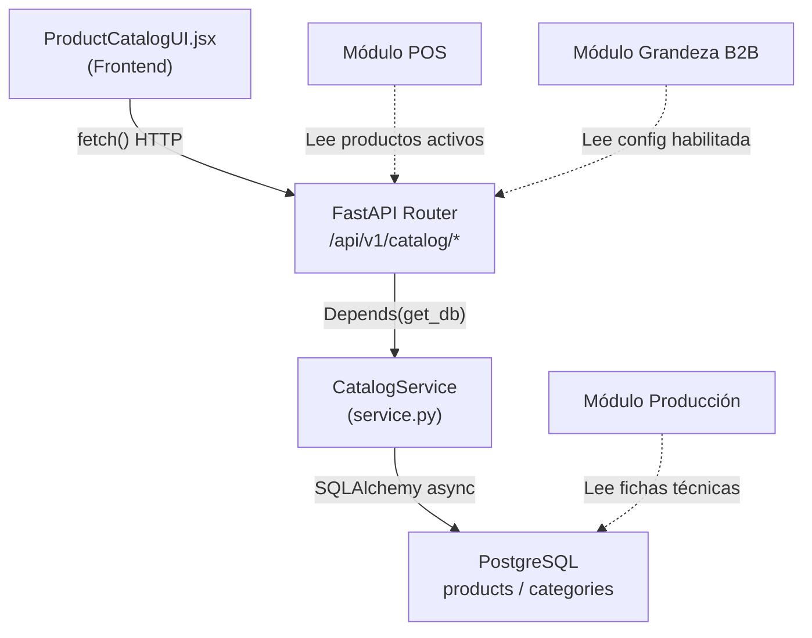
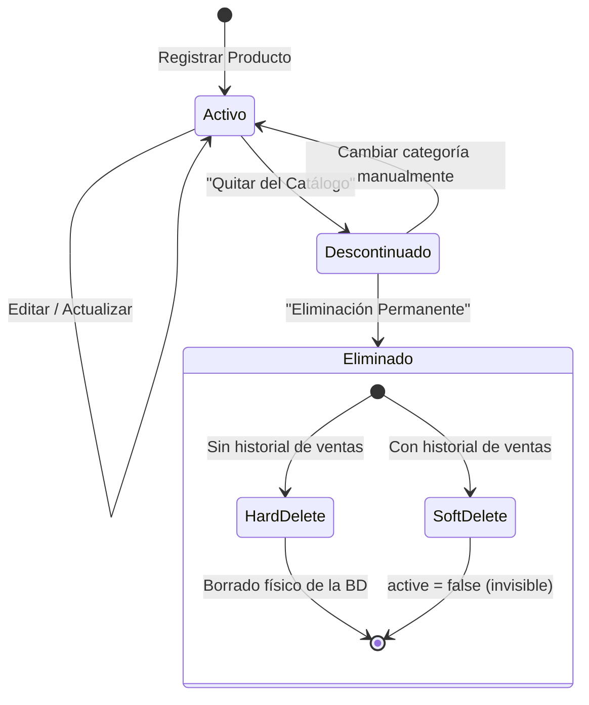

# 📦 MÓDULO: GESTIÓN DE PRODUCTOS (Maestro de Productos)

> **Versión:** 1.0  
> **Última actualización:** 10 de Junio 2026  
> **Componente Frontend:** `apps/inventory/ProductCatalogUI.jsx`  
> **Servicio Backend:** `apps/api/modules/catalog/service.py`  
> **Router API:** `apps/api/modules/catalog/router.py`  
> **Base de Datos:** PostgreSQL — Tablas `products`, `categories`, `product_technical_sheets`

---

## 1. Descripción General

El módulo de **Gestión de Productos** es el corazón del catálogo comercial del ERP R de Rico. Desde aquí se administra el ciclo de vida completo de cada producto: su creación, configuración técnica, categorización, descontinuación y eliminación definitiva.

Este módulo alimenta directamente al **Punto de Venta (POS)**, al módulo de **Producción (Panadería)**, al sistema **Reparto Pan Grandeza (B2B)** y al **KDS (Cocina)**. Cualquier cambio realizado aquí se refleja en tiempo real en todos los módulos conectados.

### Características Principales

| Función | Descripción |
|---|---|
| **Registro de Productos** | Alta de nuevos productos con SKU, precio, costo, fotografía e inventario |
| **Fichas Técnicas Dinámicas** | Campos especializados según la naturaleza del producto (Manufacturado, Preparado al Momento, Reventa, Empaque) |
| **Gestión de Categorías** | Crear, renombrar, reordenar y eliminar categorías del catálogo POS |
| **Visibilidad POS** | Control de qué categorías son visibles en el Punto de Venta |
| **Importación / Exportación** | Respaldos y cargas masivas en formato JSON |
| **Reordenamiento Drag & Drop** | Arrastrar y soltar para reordenar categorías y productos |
| **Integración Grandeza** | Configurar precios B2B para el módulo de Reparto Pan Grandeza |
| **Ciclo de Vida Seguro** | Sistema de descontinuación y eliminación con protección de integridad referencial |

---

## 2. Arquitectura y Flujo de Datos



### Endpoints API del Catálogo

| Método | Ruta | Descripción |
|---|---|---|
| `GET` | `/catalog/categories` | Lista todas las categorías ordenadas por posición |
| `POST` | `/catalog/categories` | Crea una nueva categoría |
| `PUT` | `/catalog/categories/{id}` | Renombra o modifica una categoría |
| `DELETE` | `/catalog/categories/{id}` | Elimina una categoría (si está vacía y no es de sistema) |
| `POST` | `/catalog/reorder-categories` | Reordena categorías por lista de IDs |
| `GET` | `/catalog/products` | Lista todos los productos **activos** (`active = true`) |
| `POST` | `/catalog/products` | Crea un nuevo producto con ficha técnica opcional |
| `PUT` | `/catalog/products/{id}` | Actualiza cualquier campo del producto |
| `DELETE` | `/catalog/products/{id}` | Elimina un producto (con protección de integridad) |
| `POST` | `/catalog/reorder-products` | Reordena productos por lista de IDs |
| `POST` | `/catalog/upload-image` | Sube una fotografía al servidor |
| `POST` | `/catalog/import-json` | Importación masiva en modo aditivo (no borra existentes) |

---

## 3. Modelo de Datos

### Tabla `products`

| Campo | Tipo | Descripción |
|---|---|---|
| `id` | Integer (PK) | Identificador único auto-incremental |
| `sku` | String (Unique) | Código interno del producto (ej. `SKU-1234`) |
| `barcode` | String (Unique) | Código de barras opcional |
| `name` | String | Nombre comercial del producto |
| `price` | Numeric(12,2) | Precio de venta al público |
| `cost` | Numeric(12,2) | Costo real de producción o adquisición |
| `stock` | Float | Inventario físico actual en piezas |
| `warehouse` | String | Almacén de resguardo (default: "Bóveda Central") |
| `image_url` | String | URL o ruta de la fotografía del producto |
| `position` | Integer | Posición para ordenamiento manual (drag & drop) |
| `nature` | String | Naturaleza: `MANUFACTURADO`, `PREPARADO AL MOMENTO`, `REVENTA`, `EMPAQUE` |
| `category_id` | Integer (FK) | Relación con la tabla `categories` |
| `active` | Boolean | `true` = producto visible y operativo. `false` = eliminado lógicamente |

### Tabla `categories`

| Campo | Tipo | Descripción |
|---|---|---|
| `id` | Integer (PK) | Identificador único |
| `name` | String (Unique) | Nombre de la categoría (siempre en MAYÚSCULAS) |
| `icon` | String | Icono identificador (reservado) |
| `position` | Integer | Posición para ordenamiento manual |
| `vision_enabled` | Boolean | Si `true`, la categoría es visible en el POS |
| `is_system` | Boolean | Si `true`, la categoría está protegida contra edición y borrado |

### Tabla `product_technical_sheets`

| Campo | Tipo | Descripción |
|---|---|---|
| `product_id` | Integer (FK, Unique) | Relación 1:1 con `products` |
| `primary_mass_id` | Integer (FK) | Masa primaria (referencia a `doughs`) |
| `primary_mass_grams` | Float | Gramaje de masa primaria |
| `secondary_mass_id` | Integer (FK) | Masa secundaria |
| `secondary_mass_grams` | Float | Gramaje de masa secundaria |
| `tertiary_mass_id` | Integer (FK) | Masa terciaria |
| `tertiary_mass_grams` | Float | Gramaje de masa terciaria |
| `weight_per_piece` | Float | Peso total final sugerido por pieza |
| `baking_temp_top` | Float | Temperatura de horno (arriba) |
| `baking_temp_bottom` | Float | Temperatura de horno (abajo) |
| `baking_time_min` | Integer | Tiempo de horneado en minutos |
| `steam_seconds` | Integer | Segundos de vapor |
| `scoring_type` | String | Tipo de corte/greñado |
| `forming_procedure` | Text | Procedimiento de formado |
| `preparation_time_min` | Integer | Tiempo estándar de preparación (bebidas/cocina) |
| `order_lead_time_hours` | Integer | Horas de anticipación para pedidos |
| `recipe_procedure` | Text | Procedimiento / receta de preparación |
| `modifiers` | JSON | Modificadores (ej. tamaños, extras) |
| `provider` | String | Proveedor (productos de reventa) |
| `original_barcode` | String | Código de barras original del proveedor |
| `unit_measure` | String | Unidad de medida |
| `min_stock` / `max_stock` | Integer | Stock mínimo y máximo ideal |
| `bom_extra` | JSON | Bill of Materials adicional |

---

## 4. Naturalezas de Producto

Cada producto tiene una **naturaleza** que determina qué campos técnicos están disponibles en su ficha. Esto evita mostrar campos irrelevantes (por ejemplo, temperatura de horno para una Coca-Cola).

### 🏭 MANUFACTURADO
Productos fabricados internamente (pan, pasteles, galletas). Su ficha técnica incluye:
- Masas vinculadas (primaria, secundaria, terciaria) con gramajes
- Peso por pieza
- Temperatura de horno (superior/inferior)
- Tiempo de horneado y vapor
- Tipo de greñado
- Procedimiento de formado
- Tiempo para pedidos anticipados

### 🧉 PREPARADO AL MOMENTO
Productos que se elaboran al instante bajo demanda (café, licuados, sándwiches). Su ficha incluye:
- Tiempo estándar de preparación en minutos
- Procedimiento / receta de barra o cocina

### 🏷️ REVENTA
Productos comprados a proveedores externos para revender (refrescos, frituras). Su ficha incluye:
- Proveedor / marca
- Código de barras original
- Stock mínimo ideal

### 📦 EMPAQUE
Materiales de empaque (bolsas, cajas, charolas). Campos básicos sin ficha técnica especializada.

---

## 5. Sistema de Categorías

### Categorías de Sistema vs. Categorías de Usuario

El módulo distingue dos tipos de categorías:

| Tipo | Editable | Eliminable | Ejemplo |
|---|---|---|---|
| **De Sistema** (`is_system = true`) | ❌ | ❌ | `DESCONTINUADOS` |
| **De Usuario** (`is_system = false`) | ✅ | ✅ (si está vacía) | `PANES`, `BEBIDAS`, `PASTELES` |

### Operaciones sobre Categorías

Las etiquetas de las categorías en la interfaz principal presentan un diseño limpio optimizado para **Drag & Drop**, mostrando un único botón de opciones (✏️) para evitar clics accidentales en operaciones destructivas. 

Al hacer clic en este botón, se abre el modal centralizado de **Opciones de Categoría**, desde donde se gestionan las siguientes operaciones:

- **Renombrar:** El nombre se actualiza (siempre en MAYÚSCULAS) y se sincronizan automáticamente los productos que lo contenían.
- **Visibilidad POS:** Un control interactivo (`vision_enabled`) permite ocultar o mostrar la categoría en el Punto de Venta. Las categorías ocultas se muestran desaturadas y con opacidad reducida en el gestor.
- **Eliminar:** Permite la eliminación de la categoría. Solo es posible si la categoría **NO es de sistema** y está **completamente vacía** (0 productos). Si contiene productos, el sistema bloquea la acción mostrando un modal de error indicando cuántos productos deben moverse primero.

*Otras operaciones:*
- **Crear:** Se gestiona mediante el botón "+" al final de la lista de categorías. El nombre se convierte automáticamente a MAYÚSCULAS.
- **Reordenar:** Mediante Drag & Drop directamente sobre las etiquetas de categorías en la barra superior. El nuevo orden se persiste en la base de datos (`position`).

### Categoría Especial: DESCONTINUADOS

La categoría `DESCONTINUADOS` es una **categoría de sistema** que funciona como un "limbo" o "papelera de reciclaje" para productos que ya no se venden. Sus reglas son:

1. **No puede ser renombrada ni eliminada** (protección `is_system`).
2. **No aparece en el POS** (los cajeros nunca la ven).
3. **Es el paso previo obligatorio** antes de una eliminación permanente.
4. Cualquier producto activo puede ser enviado aquí mediante el botón **"📥 Quitar del Catálogo"**.

---

## 6. Ciclo de Vida del Producto

El ciclo de vida de un producto sigue un flujo diseñado para proteger la integridad de los datos históricos (ventas, inventarios, reportes contables).



### Estados del Producto

| Estado | `active` | `category` | Visible en POS | Visible en Gestión | Eliminable |
|---|---|---|---|---|---|
| **Activo** | `true` | Cualquiera (excepto DESCONTINUADOS) | ✅ | ✅ | ❌ (solo se puede descontinuar) |
| **Descontinuado** | `true` | `DESCONTINUADOS` | ❌ | ✅ | ✅ (con credenciales) |
| **Eliminado (Hard)** | N/A | N/A | ❌ | ❌ | N/A — Ya no existe en la BD |
| **Eliminado (Soft)** | `false` | Última asignada | ❌ | ❌ | N/A — Invisible pero preservado |

### Flujo de Descontinuación ("Quitar del Catálogo")

1. El usuario abre la ficha de un producto activo.
2. Hace clic en **"📥 Quitar del Catálogo"** (botón naranja).
3. El sistema ejecuta un `PUT /catalog/products/{id}` cambiando el `category_id` a la categoría `DESCONTINUADOS`.
4. El producto desaparece de su categoría original y del POS.
5. Se muestra una notificación visual de confirmación.
6. El producto sigue accesible en la categoría `DESCONTINUADOS` del gestor.

### Flujo de Eliminación Permanente ("Destrucción")

1. El usuario navega a la categoría `DESCONTINUADOS`.
2. Abre la ficha de un producto descontinuado.
3. Si tiene las credenciales adecuadas, aparece el botón **"💀 Eliminación Permanente"** (botón rojo).
4. Se muestra un modal de **¡ALERTA CRÍTICA!** con el nombre del producto.
5. El usuario confirma presionando **"Confirmar Destrucción"**.
6. El backend ejecuta la eliminación con protección de integridad (ver Sección 7).

---

## 7. Sistema de Seguridad — "Defensa en Profundidad"

La eliminación permanente de productos es la operación más peligrosa del catálogo. Está protegida por **3 capas de seguridad independientes** que funcionan en cascada:

### Capa 1 — Restricción de Categoría (Frontend)

```
Solo si el producto está en la categoría DESCONTINUADOS se renderiza
el botón de Eliminación Permanente. Si el producto está en cualquier
otra categoría, solo se muestra el botón "Quitar del Catálogo".
```

**Archivo:** `ProductCatalogUI.jsx`, línea ~1137  
**Lógica:** `editingProduct.categories[0] !== 'DESCONTINUADOS'`

> **Resultado:** Un cajero o gestor de inventario jamás verá el botón rojo de destrucción en un producto activo. Primero debe pasar por el "limbo" de DESCONTINUADOS.

### Capa 2 — Verificación de Credenciales (Frontend)

```
Incluso estando en DESCONTINUADOS, el botón rojo solo se renderiza
si el usuario autenticado tiene el permiso 'inventory_delete = full'
o 'all = full'.
```

**Archivo:** `ProductCatalogUI.jsx`, línea ~1149  
**Lógica:** `userPermissions.inventory_delete === 'full' || userPermissions.all === 'full'`

> **Resultado:** Un empleado sin privilegios de eliminación puede ver los productos descontinuados pero NO tendrá acceso al botón de destrucción.

### Capa 3 — Validación Redundante (Frontend + Backend)

```
Al hacer clic en "Confirmar Destrucción", la función handlePermanentDelete()
vuelve a verificar los permisos ANTES de enviar la petición al servidor.
```

**Archivo:** `ProductCatalogUI.jsx`, función `handlePermanentDelete()`, línea ~287  
**Lógica:** Verifica `inventory_delete` y `all` nuevamente. Si no pasa, muestra `alert("Acceso Denegado")`.

> **Resultado:** Protección contra manipulación del DOM (si alguien fuerza la visibilidad del botón desde las herramientas de desarrollador del navegador).

### Capa 4 — Protección de Integridad Referencial (Backend)

```
El servidor intenta primero un DELETE físico. Si la base de datos
rechaza la operación por tener registros dependientes (tickets de venta,
movimientos de inventario), el sistema hace un rollback y ejecuta un
"soft delete" (active = false) que preserva el historial contable.
```

**Archivo:** `apps/api/modules/catalog/service.py`, función `delete_product()`

```python
try:
    await db.delete(db_product)       # Intenta borrado físico
    await db.commit()
    return True
except IntegrityError:
    await db.rollback()
    db_product.active = False         # Fallback: eliminación lógica
    await db.commit()
    return True
```

> **Resultado:** El producto desaparece de todas las pantallas del ERP (el query `get_products` filtra `WHERE active = true`), pero su registro se conserva en la base de datos para que los tickets de venta históricos mantengan su integridad referencial y los reportes financieros no se corrompan.

### Resumen Visual de las Capas

```
┌──────────────────────────────────────────────────────┐
│  CAPA 1: ¿Está en DESCONTINUADOS?                   │
│  ❌ NO → Solo muestra "Quitar del Catálogo"          │
│  ✅ SÍ → Pasa a Capa 2                              │
├──────────────────────────────────────────────────────┤
│  CAPA 2: ¿Tiene permiso inventory_delete = full?     │
│  ❌ NO → El botón rojo NO se renderiza               │
│  ✅ SÍ → El botón rojo aparece visible               │
├──────────────────────────────────────────────────────┤
│  CAPA 3: ¿Verificación redundante al confirmar?      │
│  ❌ NO → alert("Acceso Denegado")                    │
│  ✅ SÍ → Envía DELETE al servidor                    │
├──────────────────────────────────────────────────────┤
│  CAPA 4: ¿La BD permite borrar físicamente?          │
│  ❌ NO → Soft Delete (active = false)                │
│  ✅ SÍ → Hard Delete (registro eliminado)            │
└──────────────────────────────────────────────────────┘
```

---

## 8. Integración con Reparto Pan Grandeza (B2B)

Cada producto puede habilitarse para el módulo de Reparto Pan Grandeza. Al activar el toggle **"🍞 Reparto Pan Grandeza"** en la ficha del producto:

1. Se muestra un campo para establecer el **Precio B2B Grandeza** (diferente al precio público).
2. Al guardar, el sistema envía un `POST /grandeza/products` con el `product_id`, `b2b_price` y `is_enabled = true`.
3. Si se desactiva el toggle, el sistema envía un `DELETE /grandeza/products/{id}` para remover la configuración.
4. Las configuraciones Grandeza se cargan al inicio y se fusionan con la lista de productos para mostrar el estado del toggle correctamente.

---

## 9. Importación y Exportación

### Exportación JSON
- Genera un archivo `productos_rderico_YYYY-MM-DD.json` con todos los productos visibles.
- Descarga automática al navegador.
- Útil para respaldos manuales.

### Importación JSON
- **Modo Aditivo:** Solo agrega productos nuevos. No borra ni modifica productos existentes.
- Detecta duplicados por combinación de `name + sku`. Si ya existe, lo ignora.
- Crea categorías automáticamente si el producto referencia una categoría que no existe.
- Tras la importación, recarga la página completamente para garantizar sincronización.

---

## 10. Funcionalidades de Interfaz

### Búsqueda
- Campo de búsqueda global que filtra por **nombre** o **SKU** en tiempo real.
- Compatible con cualquier filtro de categoría activo.

### Filtro por Categoría
- Barra horizontal de categorías con scroll lateral.
- Clic para filtrar. La categoría activa se resalta en índigo.
- El filtro "TODOS" muestra el catálogo completo.

### Drag & Drop
- **Categorías:** Se pueden reordenar arrastrando las pestañas. El nuevo orden se persiste en el servidor.
- **Productos:** Se pueden reordenar dentro de una categoría específica (no funciona en vista "TODOS" para evitar conflictos de orden entre categorías).

### Tarjetas de Producto
Cada producto se muestra como una tarjeta que incluye:
- Fotografía del producto (si existe) con efecto hover de zoom
- Nombre comercial
- SKU en formato monoespaciado
- Etiqueta de categoría
- Precio de venta

### Resolución Inteligente de Imágenes
El sistema detecta automáticamente URLs de imágenes que apuntan a `localhost` o `127.0.0.1` y las reescribe al hostname real del servidor para que funcionen correctamente en tablets y dispositivos de la red LAN.

---

## 11. Permisos Requeridos

| Acción | Permiso Necesario |
|---|---|
| Ver catálogo de productos | Ninguno (acceso con sesión válida) |
| Crear / editar productos | Ninguno (acceso con sesión válida) |
| Quitar del catálogo (descontinuar) | Ninguno (acceso con sesión válida) |
| Eliminar categoría | `inventory_delete = full` ó `all = full` |
| Eliminación permanente de producto | `inventory_delete = full` ó `all = full` |

---

## 12. Consideraciones Técnicas

### Sanitización de Datos (Imperial Hardening)
Antes de enviar datos al servidor, el frontend convierte explícitamente:
- Campos de ID de masa: `""` → `null` (evita errores de tipo `int`)
- Campos numéricos: `""` → `null` o `0` según corresponda
- Campos de texto: `""` → `null`

### Sincronización en Tiempo Real
- Tras cada operación de escritura (`POST`, `PUT`, `DELETE`), el frontend ejecuta `refreshProducts()` para recargar el estado completo desde el servidor.
- Esto garantiza que la pantalla siempre refleje el estado real de la base de datos.

### Categorías Protegidas
El backend bloquea silenciosamente intentos de renombrar o modificar categorías con `is_system = true`. El método `update_category()` retorna el objeto sin cambios si detecta esta bandera.
