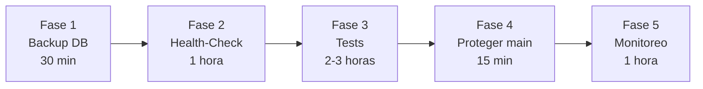

# Plan: Blindaje de Infraestructura del POS — ERP R de Rico

## Objetivo

Convertir el POS de un sistema estable *por documentación* a un sistema estable *por infraestructura*. Las 5 fases se ejecutan sobre el servidor actual (`192.168.1.117`) sin requerir equipo nuevo.

---

## Fase 1: Backup Automático de PostgreSQL (⏱️ 30 min)
**Prioridad: CRÍTICA** — Sin esto, un disco dañado = perder todas las ventas.

### Qué se hará
Crear un script que ejecute `pg_dump` dentro del contenedor `rderico-db-dev` cada noche y guarde el respaldo en una carpeta local con rotación automática (conservar últimos 7 días).

### Archivos involucrados

#### [NEW] `scripts/backup_db.ps1`
Script de PowerShell que:
1. Ejecuta `docker exec rderico-db-dev pg_dump` para generar el dump SQL.
2. Lo guarda en `C:\Users\servidor1\.gemini\antigravity\scratch\ERP-R-DE-RICO-DATA\backups\` con fecha en el nombre (`backup_2026-06-10.sql`).
3. Elimina backups con más de 7 días de antigüedad.

#### Configuración: Tarea Programada de Windows
Se creará una tarea programada (Task Scheduler) que ejecute el script a las **23:00 hrs** diariamente.

### Verificación
- Ejecutar el script manualmente y confirmar que se genera el archivo `.sql`.
- Verificar que el archivo contiene datos (`SELECT` de tablas principales).
- Esperar 24h y confirmar que la tarea programada generó el segundo backup.

---

## Fase 2: Health-Check Endpoint (⏱️ 1 hora)
**Prioridad: ALTA** — Permite detectar si el sistema está caído antes de que un cajero lo reporte.

### Qué se hará
Crear un endpoint `GET /api/v1/health` en FastAPI que valide:
- ✅ La API responde (el contenedor está vivo).
- ✅ PostgreSQL está accesible (ejecuta un `SELECT 1`).
- ✅ Reporta el uptime y la versión del sistema.

### Archivos involucrados

#### [NEW] `apps/api/modules/health/router.py`
```python
# Endpoint simple que retorna:
{
  "status": "healthy",          # o "degraded" si la BD no responde
  "database": "connected",
  "uptime_seconds": 86400,
  "version": "6.0",
  "timestamp_utc": "2026-06-10T23:00:00Z"
}
```

#### [MODIFY] `apps/api/main.py`
Registrar el nuevo router: `app.include_router(health_router, prefix="/api/v1/health")`

### Verificación
- `curl http://192.168.1.117:5001/api/v1/health` retorna `status: healthy`.
- Detener PostgreSQL temporalmente y confirmar que retorna `status: degraded`.

---

## Fase 3: Tests Unitarios para Funciones Financieras (⏱️ 2-3 horas)
**Prioridad: ALTA** — Un error en cálculo de totales o cambio = pérdida directa de dinero.

### Qué se hará
Crear tests con `pytest` que cubran las funciones críticas de cálculo:

### Archivos involucrados

#### [NEW] `apps/api/tests/test_pos_calculations.py`
Tests para:
| Función | Qué se prueba |
|---------|---------------|
| `_get_items_and_total` | Cálculo de subtotales y total correcto |
| `_get_items_and_total` | Producto inactivo lanza error |
| `_get_items_and_total` | Producto inexistente lanza 404 |
| `add_item_to_ticket` | Incrementa cantidad si el producto ya existe |
| `add_item_to_ticket` | Ticket PAID rechaza nuevos items |
| `_upsert_ticket_header` | Conflicto de versión lanza 409 |
| `_upsert_ticket_header` | Draft Guard: otra terminal no puede cobrar un DRAFT |
| `_find_empty_ticket` | Solo recicla tickets de menos de 5 minutos |
| `_cleanup_stale_empty_tickets` | GC elimina tickets vacíos >1h |

#### [NEW] `apps/api/tests/conftest.py`
Fixtures de pytest para crear una base de datos de prueba en memoria (SQLite async) con datos de ejemplo.

### Verificación
```bash
docker exec rderico-api-dev pytest tests/ --tb=short -v
```
Todos los tests deben pasar en verde.

---

## Fase 4: Proteger Rama `main` en GitHub (⏱️ 15 min)
**Prioridad: MEDIA** — Evita que un push accidental rompa producción.

### Qué se hará
Configurar **Branch Protection Rules** en GitHub para la rama `main`:

1. ✅ Requerir Pull Request antes de merge (al menos 1 aprobación — que serías tú).
2. ✅ Requerir que el status check pase (cuando tengamos CI, por ahora opcional).
3. ✅ Bloquear push directo a `main` (obliga a usar PR).

> [!IMPORTANT]
> Esto cambia tu flujo de trabajo. En vez de hacer `git push` directo, harías:
> ```bash
> git checkout -b fix/nombre-del-cambio
> git push origin fix/nombre-del-cambio
> # Crear PR en GitHub → Revisar → Merge
> ```
> Esto aplica también cuando la IA proponga cambios. Tú revisas el PR antes de que llegue a `main`.

### Verificación
- Intentar hacer `git push origin main` directo → debe ser rechazado.
- Crear un PR de prueba → debe permitir merge tras aprobación.

> [!WARNING]
> **Decisión requerida:** Este paso cambia tu forma de trabajar con la IA. Actualmente hacemos push directo a `main`. Con la protección activada, cada cambio requerirá un PR. ¿Estás cómodo con este flujo o prefieres posponerlo?

---

## Fase 5: Script de Monitoreo de Contenedores (⏱️ 1 hora)
**Prioridad: MEDIA** — Alerta si Docker se cae o un contenedor muere.

### Qué se hará
Crear un script de PowerShell que revise que los 3 contenedores (`rderico-pos-dev`, `rderico-api-dev`, `rderico-db-dev`) estén corriendo. Si alguno no está, genera una alerta visible.

### Archivos involucrados

#### [NEW] `scripts/monitor_containers.ps1`
Script que:
1. Ejecuta `docker ps` y verifica que los 3 contenedores están en estado `Up`.
2. Hace un `curl` al health-check endpoint (Fase 2) para verificar que la API responde.
3. Si algo falla, escribe un log con timestamp y opcionalmente envía una notificación (correo, Telegram, o simplemente una alerta en el escritorio de Windows).

#### Configuración: Tarea Programada de Windows
Se creará una tarea programada que ejecute el monitoreo **cada 5 minutos**.

### Verificación
- Detener un contenedor manualmente (`docker stop rderico-api-dev`).
- Verificar que el script detecta la caída y genera la alerta.
- Reiniciar el contenedor y verificar que la alerta desaparece.

---

## Orden de Ejecución Recomendado



**Tiempo total estimado: ~5 horas** (se puede hacer en 1-2 sesiones).

---

## Open Questions

> [!IMPORTANT]
> **Fase 1 (Backups):** ¿La ruta `ERP-R-DE-RICO-DATA\backups\` te parece bien para guardar los respaldos? ¿O prefieres que se copien también a un disco externo o a la nube (Google Drive, OneDrive)?

> [!IMPORTANT]
> **Fase 4 (Proteger main):** ¿Quieres activar la protección de rama ahora o prefieres seguir con push directo por el momento mientras el proyecto está en desarrollo activo?

> [!IMPORTANT]
> **Fase 5 (Alertas):** ¿Cómo prefieres recibir las alertas de caída? Opciones:
> - Notificación de Windows (globo en la barra de tareas)
> - Archivo de log local
> - Bot de Telegram (requiere crear un bot)
> - Correo electrónico (requiere configurar SMTP)
